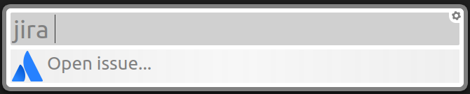
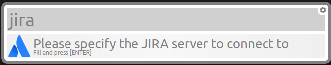

# Simple Jira extension

### Installation

`sh -c "$(wget -O- https://raw.githubusercontent.com/gabrielczar/albert-jira-extension/master/install.sh)"`

### Configuration

In the first time that you type 'jira' will be necessary configure a Jira Server.

Just write the host of your jira server like `https://jira.server.com`.

This is a message that you see:

### Commands

- Open jira issue

Just type the word 'jira' following the issue ticket to open the Jira in your browser.

- Remove jira server configuration

Just type `jira remove server`, then the action will start automatically.

