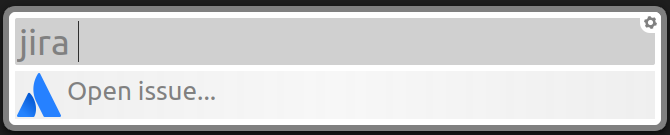

# Simple Jira Plugin

### Configuration

In the first time that you type 'jira' will be necessary configure a Jira Server.

Just write the host of your jira server like: `https://jira.server.com`.

* Just type the word 'jira' following the issue ticket to open in your browser the link.

